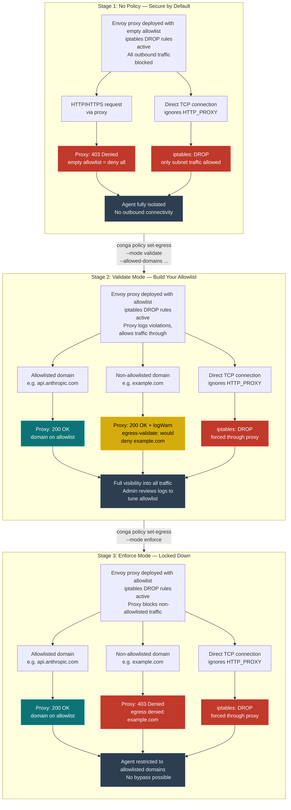
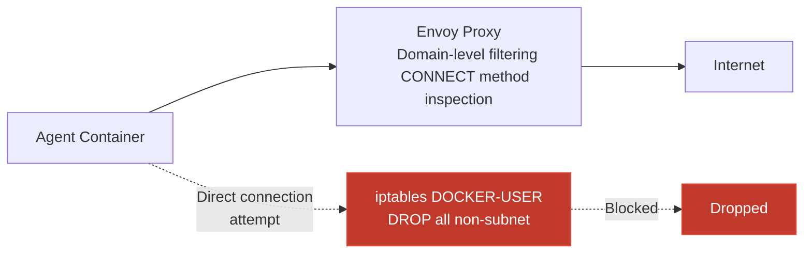

<!--
GLaDOS-MANAGED DOCUMENT
Last Updated: 2026-03-29
To modify: Edit directly.
-->

# Egress Controls — Deployment Stages & Security Scenarios

> How Conga Line restricts agent outbound network access across the three
> deployment stages. All stages apply iptables DROP rules to force traffic
> through the Envoy proxy — the proxy itself determines whether to block
> or log based on the policy mode.

## Deployment Stages



## Key Design Decisions

### iptables applied in ALL modes

iptables DROP rules are always active, regardless of egress policy mode.
Without them, tools that ignore `HTTP_PROXY`/`HTTPS_PROXY` environment
variables (direct TCP connections, `curl --noproxy`, etc.) bypass the
proxy entirely — creating blind spots in validate-mode violation logs
and enforcement gaps in enforce mode.

The proxy's Lua filter handles the mode distinction:

| Mode | Proxy Behavior | iptables Behavior |
|------|---------------|-------------------|
| **No policy** | Deny all (empty allowlist) | DROP all egress except subnet + DNS + established |
| **Validate** | Log violations, allow through | DROP all egress except subnet + DNS + established |
| **Enforce** | Block non-allowlisted (403) | DROP all egress except subnet + DNS + established |

The rule set is generated deterministically in Go (`pkg/provider/iptables/egressRuleSpecs`) from the
agent's static IP, and is identical in all modes — only the proxy's behavior changes with the mode. In
precedence order, the `DOCKER-USER` chain RETURNs (allows) traffic to the agent's own bridge subnet
(where the proxy lives), RETURNs `ESTABLISHED,RELATED` responses, RETURNs **`udp`/`tcp` dport 53 (DNS)**,
then DROPs everything else.

### DNS resolution through the fail-closed chain

The two `dport 53` RETURN rules are **load-bearing on AWS**, not an optimization. Docker's embedded
resolver forwards container DNS queries to the VPC resolver, which lives **outside** the per-agent
`10.99.<idx>.0/24` subnet — so the forwarded query is sourced from the container IP to a non-subnet
address and would otherwise hit the terminal DROP. Without these rules the agent cannot resolve any
name (including its allowed domains), so the container never becomes healthy. They allow only port 53
itself; the resolved destination is still subject to the proxy + the DROP.

### Defense in depth layers



Two independent enforcement layers ensure no single failure compromises
egress controls:

1. **Envoy proxy** — Application-layer filtering. Inspects CONNECT
   requests, matches domain against allowlist, applies mode-specific
   behavior (log or block).

2. **iptables DROP rules** — Network-layer enforcement. Ensures all
   outbound traffic from the agent container can only reach the local
   Docker subnet (where the proxy lives), plus DNS (port 53) and
   established-connection responses. Any other direct internet-bound
   connection is dropped.

### Per-agent isolation

Each agent gets its own:
- Docker bridge network
- Envoy proxy container
- iptables rule set (keyed by container IP)

No shared proxy means one agent's compromise cannot observe or interfere
with another agent's traffic.

### Global + agent policies are additive

Per-agent egress overrides do not replace the global policy — they extend it.
`MergeForAgent` (`pkg/policy/policy.go`) takes the case-insensitive union of
`allowed_domains` and `blocked_domains` between global and per-agent. Every
agent therefore inherits the global egress baseline by default; agent
overrides only need to declare what the agent additionally allows or blocks.

`mode` is the one field that still replaces, since a single value cannot
union. To deny a globally-allowed domain for one agent, list it in that
agent's `blocked_domains` — `EffectiveAllowedDomains` subtracts blocked from
allowed at enforcement time.

The bash reimplementation in `terraform/modules/infrastructure/user-data.sh.tftpl`
uses the same merge semantics; keep both in sync when changing this rule.

### Wildcard semantics: `*.example.com` matches subdomains, NOT the bare host

The Envoy Lua filter (and the Go matcher `policy.MatchDomain`) treats
`*.example.com` as a subdomain wildcard: it matches `api.example.com`
and `wss.example.com` but **NOT** the bare `example.com`. If a service
calls both subdomains AND the bare host, both must be in the allowlist
explicitly:

```hcl
egress_allowed_domains = [
  "slack.com",         # bolt-app's OAuth / app-config calls
  "*.slack.com",       # api.slack.com, wss-primary.slack.com, files.slack.com
  "*.slack-edge.com",  # CDN
]
```

**Known cases**:
- **Slack** (bolt-app SDK): hits bare `slack.com` for OAuth and
  app-config metadata. Without it, bolt-app emits 403 warnings every
  minute and the slack plugin's webhook listener can crash after
  `ack()`, returning 401 to the router's forwarded events. Symptom:
  `[router] Forward failed: 401 → http://conga-<agent>:18789/slack/events`.
- **OpenAI / Anthropic**: typically only need the subdomain
  (`api.anthropic.com`, `api.openai.com`) — no bare-host case.

If you see persistent unexplained 403s in agent logs against a
known-allowed host, check whether the bare host is missing from the
allowlist. The proxy logs `egress denied: <host>` in the request body,
not the Envoy access log.

## Operator Workflow

```mermaid
flowchart LR
    A["Deploy agent
    conga admin add-user"] --> B["Agent starts
    deny-all egress"]
    B --> C["Set validate policy
    conga policy set-egress
    --mode validate"]
    C --> D["Deploy policy
    conga policy deploy"]
    D --> E["Run agent workload
    observe proxy logs"]
    E --> F["Review violations
    conga get-proxy-logs"]
    F -->|"Tune allowlist"| C
    F -->|"Allowlist complete"| G["Switch to enforce
    conga policy set-egress
    --mode enforce"]
    G --> H["Deploy enforce
    conga policy deploy"]
    H --> I["Agent locked down
    only allowlisted domains"]
```


